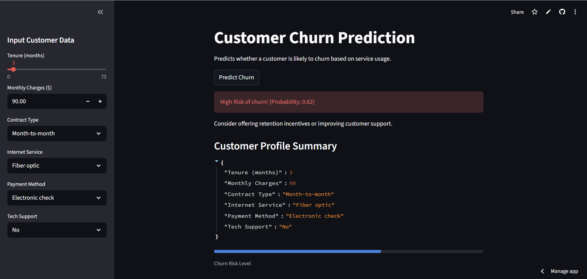
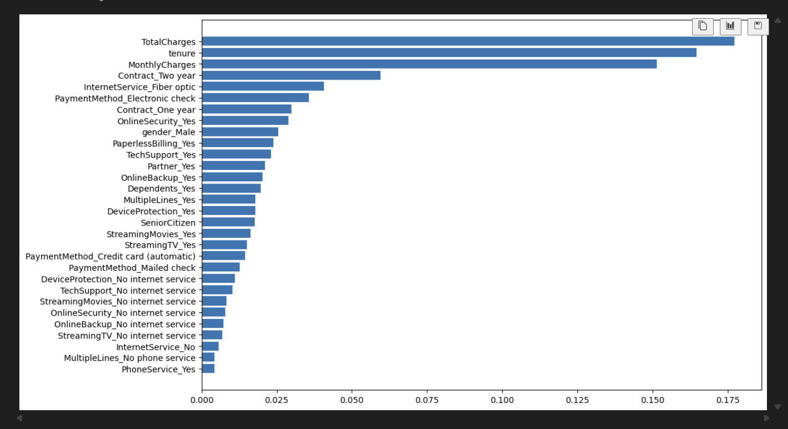
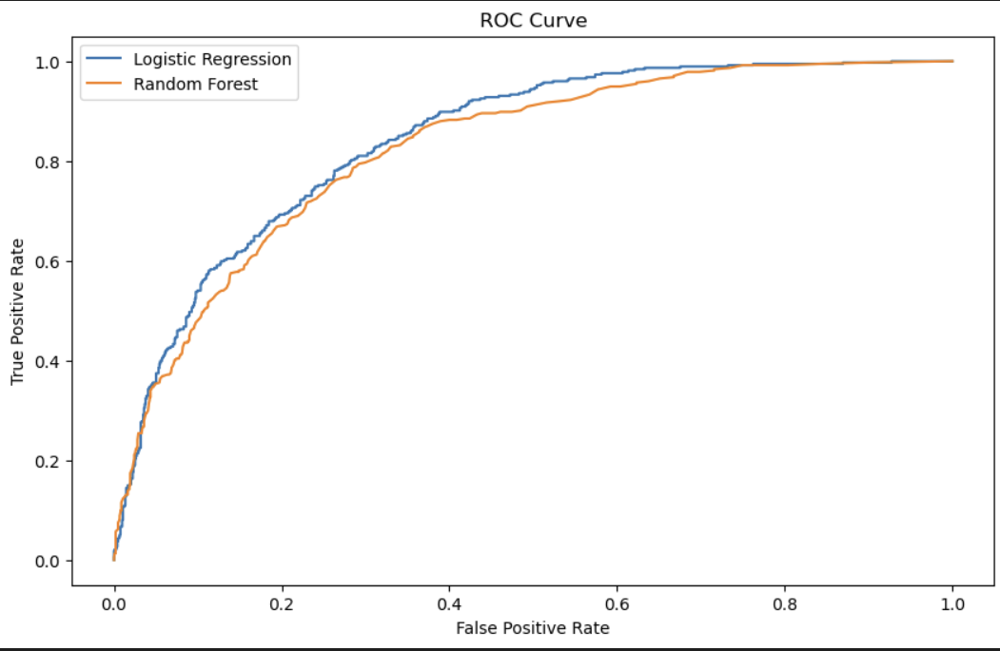

# 📉 Customer Churn Prediction

**End-to-End Machine Learning Project with Deployment**

---

## 📌 Project Overview

Customer churn is a critical business challenge where organizations aim to identify customers who are likely to stop using their services.
This project delivers an **end-to-end machine learning solution** to predict customer churn using historical customer data.

The project follows a **real-world data science workflow**, including:

* Data cleaning and preprocessing
* Exploratory data analysis (EDA)
* Feature engineering
* Model training and evaluation
* Model persistence for deployment
* Interactive web application for inference

---

## 🎯 Business Objective

* Predict whether a customer will **churn (Yes / No)**
* Identify **key drivers** of customer churn
* Enable businesses to take **proactive retention actions**

---

## 🖥️ Application Preview

### 🔹 Streamlit User Interface


### 🔹 Feature Importance


### 🔹 ROC Curve


---

## 🌐 Live Application (Deployment)

An interactive **Streamlit web application** demonstrates real-time churn prediction using the trained model.

🔗 **Live App:**
[https://thehoodguy4587-customer-churn-prediction-app-j2dvxl.streamlit.app/](https://thehoodguy4587-customer-churn-prediction-app-j2dvxl.streamlit.app/)

### Application Features

* User-friendly interface for customer input
* Real-time churn prediction with **probability score**
* Actionable business recommendations
* Uses the **same preprocessing pipeline** as model training

---

## 🗂️ Project Structure

```
Customer-churn-prediction/
│
├── notebooks/
│   ├── 01_EDA.ipynb
│   ├── 02_Feature_Engineering.ipynb
│   └── 03_Modeling_and_Evaluation.ipynb
│
├── models/
│   ├── scaler.pkl
│   ├── logistic_model.pkl
│   ├── random_forest_model.pkl
│   └── feature_names.pkl
│
├── data/
│   ├── customer_churn.csv
│   ├── X_train_scaled.npy
│   ├── X_test_scaled.npy
│   ├── y_train.csv
│   └── y_test.csv
│
├── app.py
├── requirements.txt
└── README.md
```

---

## 📊 Dataset Description

The dataset contains customer-level information such as:

* Demographics (gender, senior citizen status)
* Service usage (internet service, contract type)
* Billing information (monthly charges, total charges)

### 🎯 Target Variable

```
Churn = 1 → Customer churned
Churn = 0 → Customer retained
```

---

## 🔍 Exploratory Data Analysis (EDA)

Key insights from EDA:

* Customers with **short tenure** have higher churn probability
* **Higher monthly charges** correlate with churn
* **Month-to-month contracts** are the strongest churn indicator
* **Electronic check** payment method shows higher churn risk

EDA includes:

* Univariate analysis
* Bivariate analysis
* Distribution plots
* Churn comparison across categorical variables

---

## 🛠️ Feature Engineering

Performed in `02_Feature_Engineering.ipynb`

Steps:

* Converted `TotalCharges` to numeric format
* Handled missing values using **median imputation**
* One-hot encoded categorical variables (`drop_first=True`)
* Applied **StandardScaler** to numerical features
* Prevented data leakage by fitting scaler **only on training data**
* Saved feature names for consistent inference

---

## 🤖 Model Building

Implemented in `03_Modeling_and_Evaluation.ipynb`

### Models Used

* Logistic Regression
* Random Forest Classifier

### Model Rationale

* **Logistic Regression:** Interpretable and strong baseline
* **Random Forest:** Captures non-linear relationships

---

## 📈 Model Evaluation

### Evaluation Metrics

* Accuracy
* Precision
* Recall
* F1-score
* ROC-AUC

### Key Results

* Logistic Regression outperformed Random Forest on **ROC-AUC**
* Logistic Regression provided **better interpretability**
* ROC curves used for model comparison

---

## 🔑 Feature Importance

* Logistic Regression coefficients analyzed
* Random Forest feature importance extracted

### Key Churn Drivers Identified

* Contract type
* Tenure
* Monthly charges
* Payment method

---

## 💾 Model Persistence

Saved artifacts:

* Trained models (`.pkl`)
* Scaler object
* Feature names

These enable:

* Reuse without retraining
* Consistent preprocessing
* Seamless deployment with Streamlit

---

## 🚀 Tools & Technologies

* Python
* Pandas, NumPy
* Scikit-learn
* Matplotlib, Seaborn
* Joblib
* Streamlit
* Jupyter Notebook

---

## 📌 Key Takeaways

* End-to-end ML project following **industry best practices**
* Clean separation of **EDA, feature engineering, and modeling**
* Deployment-ready pipeline
* Strong business relevance and interpretability
* Interactive web application for real-time predictions

---

## 🔮 Future Improvements

* Hyperparameter tuning
* Cross-validation
* Advanced models (XGBoost, LightGBM)
* SHAP-based explainability
* Model monitoring and drift detection

---

## 👤 Author

**Senitha Gunathilaka**
Aspiring Data Scientist

🔗 LinkedIn:
[https://www.linkedin.com/in/senitha-gunathilaka-404236285/](https://www.linkedin.com/in/senitha-gunathilaka-404236285/)
